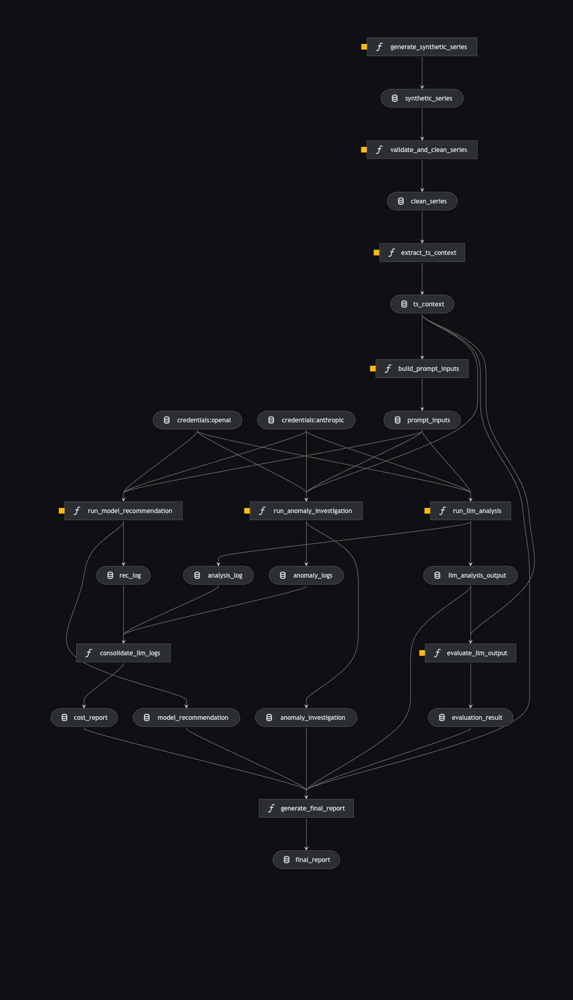

# TS-LLM Bridge

Pipeline reproduzível de análise de séries temporais com LLM, construído com **Kedro 1.x**.

Conecta expertise em séries temporais com o paradigma de Large Language Models: as features que você já sabe extrair (STL, ADF, detecção de anomalias) viram input estruturado para um LLM que gera narrativas executivas, hipóteses causais e recomendações de modelo.

---

## Visão geral

```
Série temporal bruta
        │
        ▼
[feature_extraction]  →  STL decomposition, ADF test, anomalias, contexto JSON
        │
        ▼
[llm_analysis]        →  análise completa + investigação de anomalias + modelo recomendado
        │
        ▼
[evaluation]          →  5 checks de qualidade, score e relatório final
```

**3 pipelines Kedro · LangChain + OpenAI/Anthropic · custo típico ~$0.0003/análise**

---

## Fluxograma do pipeline



O grafo mostra os nodes (funções) e os datasets (setas) conectados em três pipelines encadeados. Cada seta é um arquivo persistido no catálogo — o que permite reexecutar qualquer etapa isoladamente sem reprocessar as anteriores.

---

## Estrutura

```
ts_llm_bridge/
├── conf/
│   ├── base/
│   │   ├── catalog.yml       # datasets por camada (01_raw → 08_reporting)
│   │   ├── parameters.yml    # hiperparâmetros (LLM, STL, avaliação, dados sintéticos)
│   │   └── logging.yml
│   └── local/
│       └── credentials.yml   # API keys — nunca commitar (já no .gitignore)
├── data/
│   ├── 01_raw/
│   ├── 02_intermediate/
│   ├── 03_primary/
│   ├── 04_feature/
│   └── 08_reporting/
├── docs/                     # 6 documentos de aprendizado em português
├── src/ts_llm_bridge/
│   ├── pipelines/
│   │   ├── feature_extraction/   # série → contexto TS estruturado
│   │   ├── llm_analysis/         # contexto → chamadas LLM → JSON validado
│   │   └── evaluation/           # outputs LLM → score + relatório final
│   ├── hooks.py                  # timing por node + resumo de custo no final
│   ├── pipeline_registry.py      # registra pipelines nomeados
│   └── settings.py
└── pyproject.toml
```

---

## Setup

Requer Python 3.11+.

```bash
# 1. Instalar dependências
uv sync --extra dev

# 2. Preencher API key
# Edite conf/local/credentials.yml com sua chave OpenAI ou Anthropic

# 3. Executar
uv run kedro run                              # pipeline completo (gera série sintética e chama LLM)
uv run kedro run --pipeline=features_only     # só extração de features, sem chamar LLM
uv run kedro viz                              # grafo visual (requer extra viz)
```

---

## Pipelines disponíveis

| Pipeline | Comando | Descrição |
|---|---|---|
| `__default__` | `kedro run` | Pipeline completo |
| `features_only` | `kedro run --pipeline=features_only` | Só extração TS, sem LLM |
| `feature_extraction` | `kedro run --pipeline=feature_extraction` | Até `prompt_inputs` |
| `llm_analysis` | `kedro run --pipeline=llm_analysis` | Só chamadas LLM |
| `evaluation` | `kedro run --pipeline=evaluation` | Só avaliação e relatório |

---

## Configuração do LLM

Em `conf/base/parameters.yml`:

```yaml
llm:
  provider: "openai"          # openai | anthropic
  modelo: "gpt-4o-mini"       # modelo padrão (mais barato)
  temperatura: 0.0             # 0 = determinístico
```

Troque `provider` e `modelo` para alternar entre OpenAI e Anthropic sem mudar código.

---

## Documentação

| Arquivo | Conteúdo |
|---|---|
| [docs/01_visao_geral.md](docs/01_visao_geral.md) | Estrutura do projeto, por que Kedro |
| [docs/02_ganhos_de_entendimento.md](docs/02_ganhos_de_entendimento.md) | LLM como modelo autoregressivo, contexto, custo |
| [docs/03_conceitos_llm.md](docs/03_conceitos_llm.md) | Tokenização, contexto, temperatura, hallucination |
| [docs/04_tecnicas_llm.md](docs/04_tecnicas_llm.md) | Zero-shot, few-shot, structured output, prompt chaining |
| [docs/05_resultado_esperado.md](docs/05_resultado_esperado.md) | Exemplos reais de output JSON por etapa |
| [docs/06_conclusoes.md](docs/06_conclusoes.md) | Síntese do aprendizado e roadmap |
